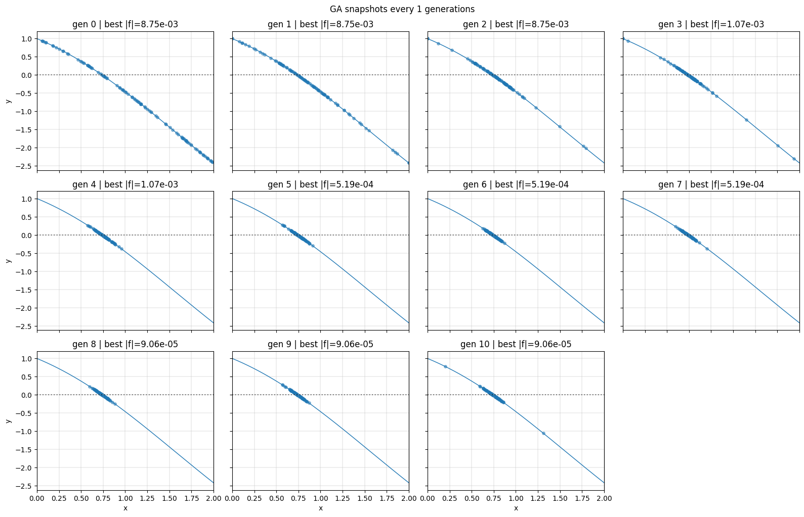

# genetic-algorithm-tutorial — 遺伝的アルゴリズムの学習のためのPythonコード

> NumPy だけで動く **最小構成 GA ライブラリ**。  
> 計算物理・実験データ解析・機械学習ハイパーパラメータ探索など、
> 「まず動く GA を読み、改造し、論文や卒研で使いたい」 学部生〜大学院初年度向け。

---

## 0. 1 分でできるようになること

| タスク                          | スクリプト                              | 所要時間 |
|---------------------------------|-----------------------------------------|-----------|
| 1 変数方程式 `cos x - x = 0`の進化の様子を散布図で確認         | `python examples/demo_root_1d_plot.py`  | 数秒       |
| 2 変数連立方程式                | `python examples/demo_root_2d.py`       | 数秒       |
| 評価関数だけ変えて最小化         | 5 行の Python                           | 任意       |

---

## 1. 推奨セットアップ（Docker / Dev Container）

> **最も簡単で再現性が高い方法** は、リポジトリ同梱の `Dockerfile` または VS Code Dev Container を使うやり方です。ローカル環境の Python やビルドツールを汚さずに、数分で GA を試せます。

### 1‑1 3 行で Docker 環境を起動
```bash
# ① イメージをビルド（初回のみ 1〜2 分）
$ docker build -t ga-tutorial .

# ② コンテナを起動してシェルへ入る
$ docker run --rm -it -v "$PWD":/workspace -w /workspace ga-tutorial bash

# ③ 例を動かす（コンテナ内）
root@container:/workspace$ python examples/demo_root_1d.py
```
> イメージには Python 3.12・NumPy・pytest・mypy など開発依存まで含まれています。`requirements*.txt` は自動でインストール済みです。

### 1‑2 VS Code Dev Container
VS Code を使う場合は **「Reopen in Container」** を押すだけで OK です。`devcontainer.json` が以下を行います。

* `Dockerfile` からイメージをビルド → コンテナを起動
* Python 拡張機能／black／ruff などを自動インストール
* `pip install -r requirements-dev.txt` を実行

> GUI でインタラクティブに Jupyter Notebook も開けるので、可視化スクリプトの調整に便利です。

### 1‑3 ローカル仮想環境でインストール（Docker を使わない場合）
```bash
# clone & cd
$ git clone https://github.com/<USER>/genetic-algorithm-tutorial.git
$ cd genetic-algorithm-tutorial

# venv 推奨
$ python -m venv .venv && source .venv/bin/activate

# 開発依存ごとインストール
$ pip install -e .[dev]
```
*Python 3.12 でテスト済みです。*

---

## 2. クイックスタート

### 2‑1  5 行で根を探す
```python
import math, numpy as np
from genalgo.population import Population
from rootfinder.fitness import make_abs_fitness

f       = lambda x: math.cos(x) - x            # 探したい関数
pop     = Population(n_individuals=80, dim=1, bounds=(0, 2), seed=0,
                     fitness_fn=make_abs_fitness(f))
root,_  = pop.evolve(generations=400, verbose=True)
print(root[0])  # ≈ 0.7391
```

### 2‑2 コマンドライン
```bash
# sin x = 0.3 の根
$ ga-root --func "math.sin(x) - 0.3" --pop 120 --gens 300
```

---

## 3. リポジトリ構成
```
├─ src/           # ライブラリ本体
│   ├─ genalgo/   #  GA コア（問題非依存）
│   └─ rootfinder/#  例題: f(x)=0
├─ examples/      # スクリプト集（1D/2D/可視化）
├─ tests/         # pytest & mypy
└─ docs/          # Markdown 説明
```

---

## 4. GA の中身
1. **初期化** — 一様乱数で `(N, dim)` 行列を生成
2. **評価** — `fitness_fn` を行ごとに適用 → `(N,)` スカラー
3. **親選択** — k トーナメント or ルーレット or ランク
4. **交叉** — 1 点、BLX‑α、SBX から選択可
5. **変異** — ガウスノイズ。`bounds` で安全柵
6. **エリート保持** — 最良個体は必ず生存
7. **早期停止** — 改善停滞・目標適応度・世代上限
8. **履歴** — `record_every` で genes を保存（可視化に便利）

> 詳細数式は `docs/DETAILS_CROSSOVER_MUTATION.md` 参照

---

## 5. パラメータ早見表
| 名前               | 意味 & 範囲           | コード位置 / CLI |
|--------------------|-----------------------|-----------------|
| `POP_SIZE`         | 個体数 `N`            | examples/*.py   |
| `GENERATIONS`      | ループ回数            | examples/*.py   |
| `crossover_rate`   | 0–1 交叉確率          | `Population.evolve` |
| `mutation_sigma`   | 変異ノイズ σ         | 同上            |
| `mutation_prob`    | 変異確率 (遺伝子単位)  | 同上            |
| `patience / tol`   | 改善停滞しきい値       | 同上            |
| `record_every`     | 履歴保存間隔           | 同上            |

---

## 6. 演算子を差し替えてみる
```python
from genalgo.crossover import blx_alpha
from genalgo.selection import roulette_select

pop = Population(...)

best,_ = pop.evolve(generations=300,
                    selector=lambda f, r: roulette_select(f, rng=r),
                    crossover_op=lambda a,b,r: blx_alpha(a,b,alpha=0.5,rng=r))
```
関数が **Protocol 型** を満たしていれば、どんな自作演算子でも渡せます。

---

## 7. 可視化ツール
1. [examples/demo_root_1d.py](examples/demo_root_1d.py) — 1変数方程式の解の世代ごとの散布図
1. [examples/demo_root_2d.py](examples/demo_root_2d.py)     — 2元連立方程式の解の世代ごとの散布図

参考画像（1D 根探索）
1. １変数の方程式への適用
    このファイルでは、以下の１変数の方程式
    ```math
    \cos(x) - x = 0
    ```
    に対して遺伝的アルゴリズムを適用した場合の集団の変遷をグラフで確認できます。
    

1. 2元連立方程式への適用

    このファイルでは、遺伝的アルゴリズムを二元連立方程式に適用します。
    ```math
    \begin{align}
        f_1(x, y) &= x + y - 1 = 0 \notag\\
        f_2(x, y) &= x^2 + y^2 - 1 = 0 \notag
    \end{align}
    ```

    - 評価関数
    
        評価関数は解との距離の二乗です。本ライブラリでは評価関数が小さいほどランキングの順位が高いです。

        ```math
        |f_1(x, y)|^2 + |f_2(x, y)|^2
        ```

    - 計算設定

        ```python
            POP_SIZE = 1000                      # 集団のサイズ
            GENERATIONS = 40                     # 計算する世代数
            SEED = None                          # 初期集団を準備する際の乱数のシード
            BOUNDS = ((-2.0, 2.0), (-2.0, 2.0))  # x, yの値の範囲
            MUT_SIGMA = 0.05                     # 突然変異の確率
            RECORD_EVERY = 1                     # 何世代ごとに履歴を保存するか
            PLOT_INTERVAL = 1                    # 何世代間隔で表示するか
            ENABLE_EARLY_STOP = True             # 集団の性質が変わらないときに停止するかどうか
        ```
    - 結果

        以下のグラフは各世代のx, yの値の分布です。$$(x, y) = (1, 0)$$に集団の分布が偏っていく様子がわかります。
        
        この方程式の解は$$(x, y) = (1, 0), (0, 1)$$なので、初期集団を変えると収束する位置が変わります。
        


---

## 8. 開発ツール
```bash
pytest -q           # テスト
ruff check src      # PEP8 + α lint
mypy --strict src   # 型チェック（Protocol も確認）
```
CI サンプルは `.github/workflows/ci.yml` にあります。

---

<!-- ## 9. よくある Q&A
| 質問 | 回答 |
|------|------|
| 勾配があるなら GA より速い手法は？ | はい。勾配法や準ニュートン法が速いです。GA は多峰性や離散変数で威力を発揮します。 |
| 変数が 50 次元でも使える？ | 動きますが個体数や世代数を大きくすると計算量が増えます。σ を次第に小さくするアニーリングが有効です。 |
| 連立方程式以外に使う例？ | ポテンシャル最小化、材料組成最適化、ML ハイパーパラメータ探索など。 | -->

---

## 9. ライセンスと引用
MIT License. 研究・教育・商用すべて OK。  
引用例:
```
H. Tsusaka. *genetic-algorithm-tutorial*, 2025, GitHub repository.
```