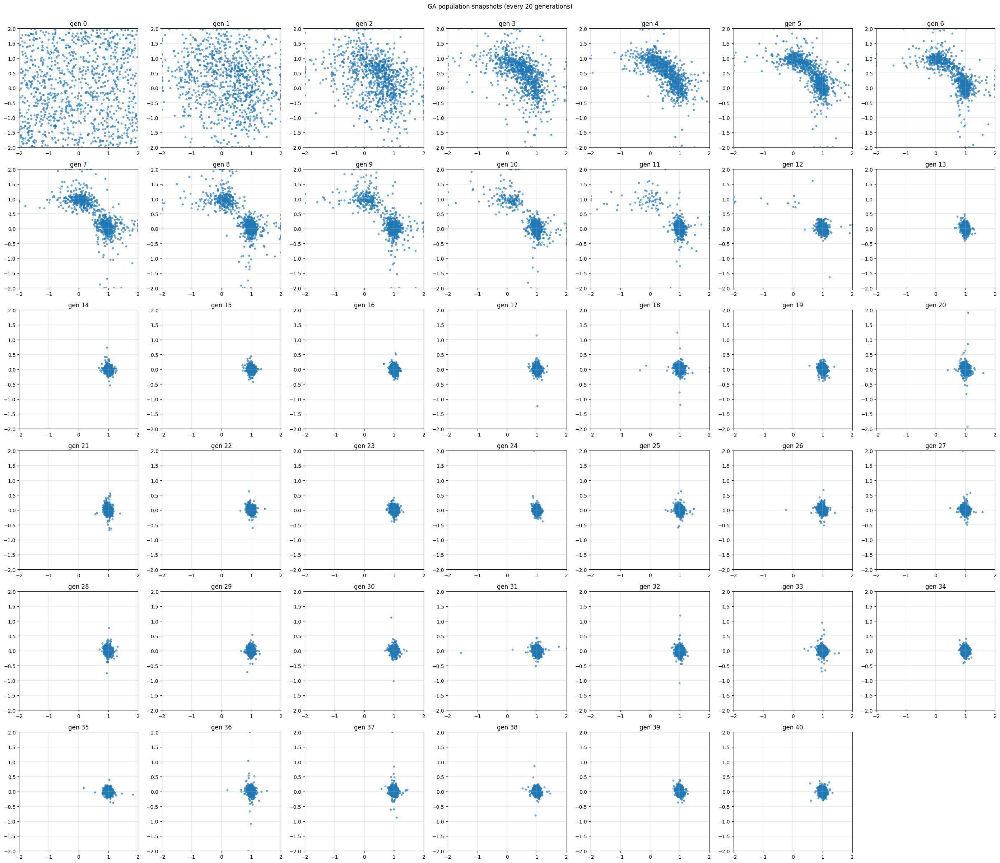
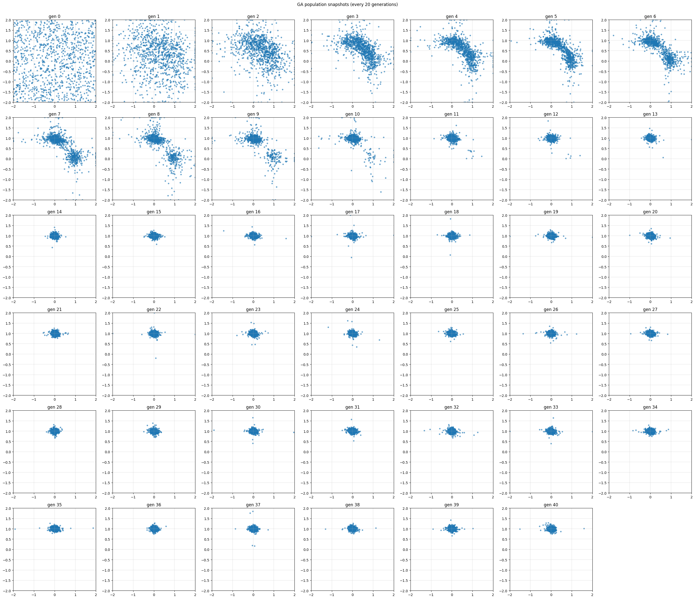

# genetic-algorithms — 遺伝的アルゴリズムの理解のためのPythonコード

NumPy ベースの科学計算で利用できる **遺伝的アルゴリズム (GA) エンジン** です。Python で数値最適化を行う学生・研究者向けに、最小限のコードで遺伝的アルゴリズムを使用しながら学べる構成にしました。

---

## 特長

| ポイント        | 概要                                                   |
| ----------- | ---------------------------------------------------- |
| 演算子の差し替え    | `crossover`・`mutation`・`selection` を関数として注入できます。     |
| 型チェック対応     | `mypy --strict` に準拠し、演算子のシグネチャを `Protocol` で明示しています。 |
| エリート保持と早期停止 | 最良個体を保持しつつ、改善が止まった場合は計算を終了します。                       |
| 範囲制限付き変異    | `bounds` で物理的に不適切な値を自動でクリップします。                      |
| CLI の提供     | `ga-root --func "math.sin(x)"` のようにコマンドラインから利用できます。  |

---

## 目次

1. [インストール](#インストール)
2. [クイックスタート](#クイックスタート)
3. [ディレクトリ構成](#ディレクトリ構成)
4. [API の概要](#api-の概要)
5. [アルゴリズムの概要](#アルゴリズムの概要)
6. [テストと静的解析](#テストと静的解析)
7. [Docker](#docker)
8. [貢献方法](#貢献方法)
9. [ライセンス](#ライセンス)

---

## インストール

```bash
# リポジトリの取得
$ git clone https://github.com/yourname/genetic-algorithms.git
$ cd genetic-algorithms

# 仮想環境の作成（推奨）
$ python -m venv .venv && source .venv/bin/activate

# 開発用依存を含めてインストール
$ pip install -e .[dev]
```

Python 3.9 以降で動作を確認しています。

---

## クイックスタート

### Python スクリプトから

```python
import math, numpy as np
from genalgo.population import Population
from rootfinder.fitness import make_abs_fitness

f = lambda x: math.cos(x) - x  # 目的関数
genes0 = np.random.default_rng(0).uniform(0, 2, (100, 1))
fitness = make_abs_fitness(f)

pop = Population(genes0, fitness)
root, err = pop.evolve(generations=300,
                       mutation_sigma=0.05,
                       bounds=(0, 2))
print(root[0], err)
```

### コマンドラインから

```bash
$ ga-root --func "math.tan(x) - x" --pop 150 --gens 400
Approx. root: x = 4.4934   |f(x)| = 2.1e-05
```

---

## ディレクトリ構成

```
.
├── src/
│   ├── genalgo/      # 汎用 GA エンジン
│   └── rootfinder/   # f(x)=0 を例とした応用
├── tests/            # pytest テストケース
├── examples/         # 使用例スクリプト
├── docs/             # ドキュメント
├── Dockerfile        # 開発用イメージ
└── pyproject.toml    # ビルド設定
```

---

## API の概要

| モジュール                | 主なクラス・関数                        | 内容                      |
| -------------------- | ------------------------------- | ----------------------- |
| `genalgo.population` | `Population`                    | `evolve()` を備える GA エンジン |
| `genalgo.selection`  | `tournament_select`             | k-トーナメントによる親選択      |
| `genalgo.crossover`  | `one_point` / `_noop_crossover` | 実数ベクトル用交叉演算子        |
| `genalgo.mutation`   | `gaussian`                      | ガウス変異（範囲クリップ付き）  |
| `rootfinder.fitness` | `make_abs_fitness`              | f(x)を最小化するラッパ |

---

## アルゴリズムの概要

1. 初期化 — 集団行列 `genes ∈ ℝ^{N×d}` を生成。
2. 適応度評価 — `fitness_fn` を個体ごとに適用してスカラー値を得る。
3. 親選択 — k-トーナメントで 2 個体を選ぶ。
4. 交叉 — 1 点交叉（一次元の場合はスキップ）。
5. 変異 — ガウス雑音を与え、範囲外をクリップ。
6. エリート保持 — 最良個体を次世代へコピー。
7. 早期停止 — 改善幅が閾値未満の状態が一定世代続いた場合など。

---

## 使用例

1. [examples/demo_root_2d.py](examples/demo_root_2d.py)
    このファイルでは、遺伝的アルゴリズムを二元連立方程式に適用します。
    ```math
    \begin{align}
        f_1(x, y) &= x + y - 1 = 0 \notag\\
        f_2(x, y) &= x^2 + y^2 - 1 = 0 \notag
    \end{align}
    ```
    - 評価関数

        ```math
            \begin{align}
                |f_1(x, y)|^2 + |f_2(x, y)|^2 \notag
            \end{align}
        ```

    - 計算設定
        ```python
            POP_SIZE = 1000                      # 集団のサイズ
            GENERATIONS = 40                     # 計算する世代数
            SEED = None                          # 初期集団を準備する際の乱数のシード
            BOUNDS = ((-2.0, 2.0), (-2.0, 2.0))  # x, yの値の範囲
            MUT_SIGMA = 0.05                     # 突然変異の確率
            RECORD_EVERY = 1                     # 何世代ごとに履歴を保存するか
            PLOT_INTERVAL = 1                    # 何世代間隔で表示するか
            ENABLE_EARLY_STOP = True             # 集団の性質が変わらないときに停止するかどうか
        ```
    - 結果
        以下のグラフは各世代のx, yの値の分布です。$$(x, y) = (1, 0)$$に集団の分布が偏っていく様子がわかります。
        
        この方程式の解は$$(x, y) = (1, 0), (0, 1)$$なので、初期集団を変えると収束する位置が変わります。
        


## テストと静的解析

```bash
pytest            # ユニットテスト
ruff check src/   # コードチェック
mypy --strict src # 型チェック
```

---

## Docker

```bash
# イメージのビルド
$ docker build -t ga-dev .

# テストの実行
$ docker run --rm ga-dev pytest -q
```

---

## ライセンス

MIT License です。
